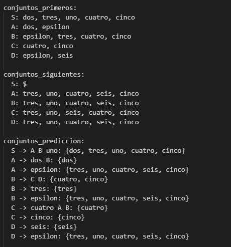

# Comparación del Cálculo Manual y en Código de los Primeros, Siguientes y Predicción de una Gramática

Este repositorio contiene una comparación entre el cálculo manual y la implementación en Python de los conjuntos de primeros, siguientes y predicción de una gramática.

## Cómo usar

**Requisitos:** Para ejecutar este proyecto se debe tener instalado Python3.

1. Clonar el repositorio con `git clone https://github.com/whocar3s/Conjuntos-de-primeros-siguientes-y-predicci-n.git`

2. Para ejecutar el codigo de las gramáticas correspondistentes se usa el comando `python3 G1.py` para la primera gramática o `python3 G2.py` para la segunda gramática.

   
## Cálculo Manual
**Gramática 1**

  
  
**Gramática 2**

  

## Implementación en Python

**Gramática 1**

  
  
**Gramática 2**

  

## Conclusión
Las coincidencias entre los cálculos manuales y los resultados obtenidos mediante la implementación en Python valida la precisión y fiabilidad de esta última. Este resultado muestra una implementación acertada y precisa de los algoritmos necesarios para calcular los conjuntos de primeros, siguientes y predicción en el contexto de la gramática estudiada. 

## Miembros del grupo

- Laura González
- Camilo Madero
- Paula Páez
- Felipe Rodriguez
